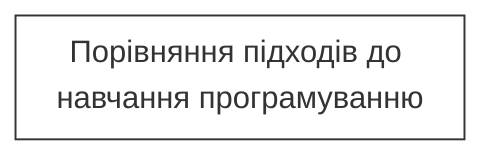
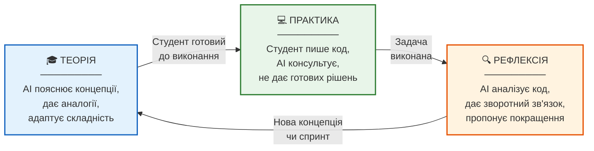
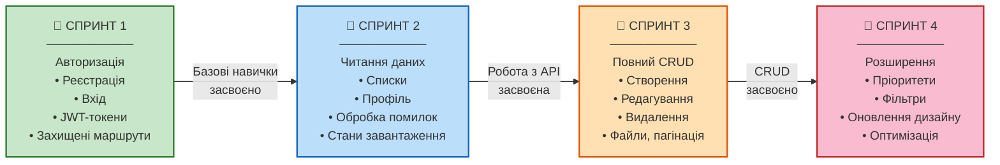
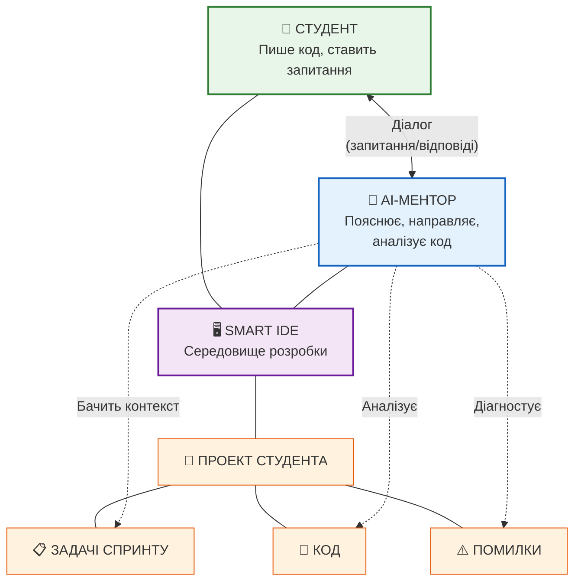
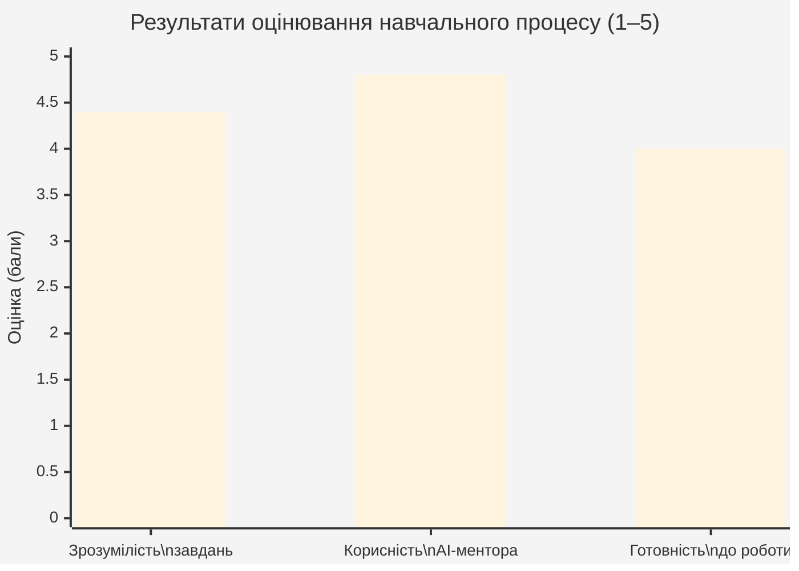

# Штучний інтелект як персональний ментор у процесі підготовки фронтенд-розробників у закладах вищої освіти

## Анотація

У статті досліджується можливість використання штучного інтелекту на основі великих мовних моделей (LLM) як персонального ментора для студентів, що навчаються фронтенд-розробці у закладах вищої освіти. Обґрунтовано теоретичні засади AI-менторства, описано методику навчання з підтримкою AI, наведено приклад практичної реалізації та результати експериментальної апробації. Результати дослідження свідчать про високу ефективність AI-ментора (оцінка корисності 4.8 з 5) та доцільність його інтеграції у навчальний процес.

**Ключові слова:** штучний інтелект, менторство, фронтенд-розробка, навчання програмуванню, великі мовні моделі, React, заклади вищої освіти.

---

## 1. Вступ

Сучасний ринок праці у сфері інформаційних технологій характеризується стабільно високим попитом на фронтенд-розробників. За даними щорічних опитувань розробників, JavaScript залишається найпопулярнішою мовою програмування вже понад десятиліття, а React — найбільш затребуваним фреймворком для побудови інтерфейсів користувача [1]. Роботодавці очікують від кандидатів не лише знання синтаксису, а й розуміння архітектурних патернів, досвід роботи з реальними API, систему контролю версій та вміння самостійно вирішувати комплексні технічні задачі.

Водночас традиційна система вищої освіти не завжди забезпечує необхідний рівень практичної підготовки. Лекційний формат формує теоретичну базу, проте не розвиває навичок самостійного вирішення задач у реальному контексті. Лабораторні роботи, як правило, є ізольованими вправами, що не відображають складність комерційної розробки. Онлайн-курси пропонують структуроване навчання, але часто зводяться до пасивного повторення дій інструктора.

Класичне менторство визнається одним із найефективніших методів навчання програмуванню. Досвідчений наставник адаптує пояснення під рівень студента, дає персоналізований зворотний зв'язок та направляє у правильному напрямку без надання готових рішень. Проте менторство є дорогим, обмеженим у часі та не масштабується — один ментор фізично не може супроводжувати десятки студентів одночасно.

Розвиток великих мовних моделей (LLM) відкриває принципово нові можливості для вирішення цієї проблеми. Сучасні AI-системи здатні виконувати ключові функції ментора: пояснювати концепції, генерувати навчальні завдання, аналізувати код, готувати до технічних співбесід — при цьому залишаючись безкоштовними (у межах безкоштовних тарифів), доступними цілодобово та здатними адаптуватися під контекст конкретного проекту студента. За даними Stack Overflow Developer Survey 2025, 44% розробників використовують AI-інструменти для навчання новим технологіям, що на 7 процентних пунктів більше порівняно з попереднім роком [1]. Дослідження, опубліковане у Nature (2025), підтверджує: студенти, що навчаються з AI-тьютором, засвоюють матеріал швидше та демонструють вищу мотивацію порівняно з традиційним форматом [4].

**Мета статті** — обґрунтувати та описати методику використання штучного інтелекту як персонального ментора у процесі навчання фронтенд-розробці, а також підтвердити її ефективність результатами експериментальної апробації.

**Об'єкт дослідження** — процес підготовки фронтенд-розробників у закладах вищої освіти.

**Предмет дослідження** — методика використання AI на основі LLM як персонального ментора у навчанні фронтенд-розробці.

**Методи дослідження:** аналіз літературних джерел, порівняльний аналіз підходів до навчання, експериментальний метод, анкетування.

---

## 2. Проблема підготовки програмістів у ЗВО та обмеження традиційних підходів

### 2.1. Розрив між академічною підготовкою та вимогами ринку

Аналіз вакансій Junior Frontend Developer на українському та міжнародному ринках дозволяє виділити типові вимоги роботодавців: впевнене володіння JavaScript/TypeScript, досвід роботи з React (hooks, state management, routing), розуміння REST API та HTTP-протоколу, робота з Git, базові знання CI/CD, вміння працювати з існуючою кодовою базою.

Порівняння цих вимог з типовою навчальною програмою ЗВО виявляє суттєвий розрив. Академічні курси зосереджені на фундаментальних дисциплінах (алгоритми, структури даних, теорія обчислень), що формують необхідну базу, проте не дають практичного досвіду з сучасними фреймворками та інструментами. Студент, який успішно склав іспит з «Веб-технологій», часто не здатен самостійно побудувати повноцінний React-додаток з авторизацією, маршрутизацією та взаємодією з сервером.

### 2.2. Обмеження існуючих форматів навчання

**Лекції та лабораторні роботи** забезпечують структуроване засвоєння матеріалу, проте мають фіксований темп та не адаптуються під індивідуальний рівень студента. Студент, який не зрозумів концепцію з першого разу, не має можливості отримати повторне пояснення під іншим кутом.

**Онлайн-курси** пропонують самостійне навчання, проте переважно у форматі «повторюй за інструктором». Студент відтворює код з відео, але не формує навичку самостійного вирішення задач. При виникненні проблеми, не описаної у курсі, студент залишається без підтримки.

**Самостійне навчання за документацією** вимагає високого рівня самоорганізації та попереднього досвіду. Початківець часто не знає, що саме шукати, не розуміє контексту прочитаного та не має зворотного зв'язку щодо якості свого рішення.

### 2.3. Менторство: ефективне, але не масштабоване

Індивідуальне менторство визнається найефективнішим підходом до навчання програмуванню [3]. Ментор виконує кілька критичних функцій:
- адаптує пояснення під рівень розуміння студента;
- дає зворотний зв'язок щодо коду (code review);
- направляє до правильного рішення без його прямого надання;
- допомагає формувати правильний підхід до вирішення задач;
- мотивує та підтримує при невдачах.

Проте менторство має суттєві обмеження масштабованості: воно є фінансово затратним, обмеженим у часі (ментор доступний лише у визначені години), суб'єктивним (залежить від компетенції конкретної людини) та не відтворюваним (кожна сесія унікальна).

**Таблиця 2 — Порівняння підходів до навчання програмуванню**

| Критерій | Лекції/Лаб. | Онлайн-курси | Живий ментор | AI-ментор |
|----------|:-----------:|:------------:|:------------:|:---------:|
| Доступність (час) | За розкладом | 24/7 | За домовленістю | 24/7 |
| Вартість | Включено в навчання | Безкоштовно / платно | Висока | Безкоштовно |
| Персоналізація | Низька | Низька | Висока | Висока |
| Масштабованість | Середня | Висока | Низька | Висока |
| Зворотний зв'язок | Обмежений | Відсутній / автоматичний | Якісний | Якісний |
| Адаптивність пояснень | Низька | Відсутня | Висока | Висока |
| Терпіння | Обмежене | — | Обмежене | Необмежене |
| Контекст проекту | Ні | Ні | Так | Так |

**Рис. 2 — Порівняння підходів до навчання програмуванню**

---

## 3. AI як ментор: теоретичне обґрунтування

### 3.1. Можливості сучасних LLM у контексті навчання

Великі мовні моделі (GPT, Claude, Gemini та інші) продемонстрували здатність ефективно виконувати низку функцій, що традиційно належать до компетенції ментора [5, 6]:

1. **Пояснення теоретичних концепцій.** AI здатний пояснити будь-яку концепцію фронтенд-розробки (React hooks, Virtual DOM, state management, HTTP-протокол) адаптивно — від базового рівня до поглибленого, з аналогіями, прикладами та повторними поясненнями під різними кутами. На відміну від людини-ментора, AI не втомлюється і готовий пояснювати одне й те саме сто разів без роздратування.

2. **Генерація навчальних завдань.** AI може створювати практичні задачі відповідного рівня складності: від простих (зверстати компонент за описом) до комплексних (спроектувати архітектуру модулю авторизації). Задачі генеруються з детальними критеріями прийняття, що дозволяє студенту самостійно оцінити результат.

3. **Аналіз коду та зворотний зв'язок.** AI аналізує написаний студентом код, виявляє потенційні проблеми (порушення принципів, неоптимальні рішення, потенційні баги) та пропонує напрямки покращення — без надання готового коду.

4. **Підготовка до технічних співбесід.** AI моделює формат технічного інтерв'ю: ставить типові запитання (closure, event loop, React lifecycle, оптимізація рендерингу), аналізує відповіді студента та вказує на прогалини у розумінні.

5. **Архітектурне консультування.** При роботі над пет-проектом AI допомагає приймати архітектурні рішення: структура файлів, розподіл відповідальності між компонентами, вибір бібліотек, патерни управління станом.

### 3.2. Ключові переваги AI-менторства

**Безкоштовність.** Сучасні LLM пропонують безкоштовні тарифні плани з достатнім обсягом для навчальних цілей. Студент може отримувати менторську підтримку без фінансових витрат, що особливо актуально для української аудиторії.

**Цілодобова доступність.** AI доступний 24/7, що дозволяє студенту працювати у зручному темпі — вночі, на вихідних, під час канікул. Немає потреби узгоджувати розклад з ментором.

**Необмежене терпіння.** AI готовий пояснювати одну й ту саму концепцію необмежену кількість разів, з різних ракурсів, з різними аналогіями — без осуду чи нетерпіння. Це знімає психологічний бар'єр «соромно запитати ще раз».

**Персоналізація через контекст.** При роботі у середовищі розробки (Smart IDE) AI має доступ до проекту студента: бачить структуру коду, поточні файли, помилки. Це дозволяє давати відповіді не абстрактно, а в контексті конкретної задачі студента.

**Формування самостійності.** При правильній методиці AI не дає готових рішень, а направляє студента: задає навідні запитання, пропонує подумати у певному напрямку, вказує на документацію. Це розвиває навичку самостійного пошуку рішень.

### 3.3. Обмеження та зіставлення ризиків

AI-менторство має відомі обмеження: можливість генерації некоректної інформації (галюцинації), ризик формування залежності від AI при недостатній самодисципліні студента, необхідність верифікації відповідей.

Водночас ці ризики слід розглядати у контексті альтернатив [8]. Некоректна відповідь AI коштує студенту 20–30 хвилин додаткового дебагу та пошуку правильного рішення. Відсутність будь-якого менторства коштує тижні стагнації, втрату мотивації та потенційне залишення професії. Послуги живого ментора є фінансово затратними та обмеженими у часі.

Більш того, навичка критичної оцінки відповідей AI є сама по собі цінною професійною компетенцією. Сучасний розробник постійно використовує AI-інструменти у роботі, і вміння верифікувати їх вихід — необхідна навичка для ринку праці.

### 3.4. Вимоги до студента

AI-менторство не є пасивним процесом. Для ефективного використання AI як ментора від студента вимагається:
- **самостійність** — AI направляє, але код пише студент;
- **бажання розібратися** — ставити уточнюючі запитання, а не копіювати перший результат;
- **дисципліна** — регулярна практика, виконання завдань повністю;
- **критичне мислення** — перевіряти відповіді AI, звірятися з документацією;
- **ініціативність** — формулювати конкретні запитання, описувати контекст проблеми.

---

## 4. Методика навчання фронтенд-розробці з AI-ментором

### 4.1. Загальна модель навчального циклу

Запропонована методика базується на циклічній моделі: **теорія → практика → рефлексія**, де AI виступає підтримкою на кожному етапі (рис. 1).

**Рис. 1 — Циклічна модель навчання з AI-ментором**

На етапі **теорії** студент вивчає нову концепцію за допомогою AI: отримує пояснення, аналогії, приклади використання. AI адаптує складність пояснень під рівень студента.

На етапі **практики** студент виконує завдання самостійно. AI виступає в ролі консультанта — відповідає на запитання, дає підказки, але не пише код за студента.

На етапі **рефлексії** студент показує результат AI для аналізу: отримує зворотний зв'язок щодо якості коду, архітектурних рішень, можливих покращень.

### 4.2. Теоретичне навчання з AI

AI-ментор ефективний для вивчення теоретичних концепцій фронтенд-розробки. Типові сценарії взаємодії:

- «Поясни, як працює useEffect у React і коли він спрацьовує» — AI дає пояснення з прикладами, аналогією з життєвим циклом компонента;
- «Я не розумію, чому мій стан не оновлюється одразу після setState» — AI пояснює асинхронність оновлення стану, batching, замикання;
- «Поясни різницю між controlled та uncontrolled компонентами ще раз, з іншого боку» — AI формулює те саме з іншого ракурсу, з іншою аналогією.

Ключова перевага: студент може повертатися до одного питання необмежену кількість разів, щоразу уточнюючи своє розуміння, без соціального тиску та обмежень у часі.

### 4.3. Практичне навчання: AI як генератор навчального середовища

Центральний елемент методики — AI не лише менторить, а й **самостійно генерує навчальний проект** для студента.

Процес виглядає наступним чином:
1. Студент обирає домен проекту («менеджер задач», «інтернет-магазин», «блог-платформа») або просить AI запропонувати проект відповідного рівня складності.
2. AI проектує архітектуру: визначає сторінки, компоненти, API-ендпоінти, модель даних.
3. AI розбиває проект на спринти з поступовим ускладненням та створює набір структурованих задач з детальними сценаріями прийняття.
4. Студент виконує задачі послідовно, AI менторить по ходу виконання.
5. Після виконання кожної задачі AI аналізує результат та дає зворотний зв'язок.

Такий підхід імітує реальний робочий процес в IT-компанії: розробник отримує задачу з описом вимог, реалізує її самостійно та проходить code review.

### 4.4. Підготовка до технічних співбесід

AI ефективно моделює формат технічного інтерв'ю для фронтенд-розробника:

- **Теоретичні питання:** «Поясни event loop у JavaScript», «Як працює Virtual DOM?», «Що таке closure і наведи приклад?»
- **Практичні задачі:** «Реалізуй debounce функцію», «Напиши custom hook для роботи з localStorage»
- **Архітектурні питання:** «Як би ти організував стан у додатку з 20+ сторінками?», «Коли варто використовувати Redux, а коли — Context API?»

AI аналізує відповіді студента, вказує на неточності та пропонує доповнити відповідь — так само, як це робив би інтерв'юер у діалоговому форматі.

### 4.5. Пет-проекти з AI-ментором

Найбільш комплексний сценарій — розробка повноцінного пет-проекту під менторством AI. Студент створює проект від нуля: від ініціалізації репозиторію до деплою. AI виступає архітектурним радником та рев'юером:

- допомагає обрати технології та обґрунтувати вибір;
- рецензує структуру проекту та пропонує покращення;
- аналізує написаний код та вказує на проблеми;
- пропонує нові фічі для розширення функціоналу.

Результат — студент має портфольний проект, написаний самостійно, з розумінням кожного рядка коду.

---

## 5. Приклад практичної реалізації методики

### 5.1. Опис навчальної платформи

Для верифікації запропонованої методики розроблено навчальну платформу, яка реалізує описані принципи на практиці. Платформа являє собою повноцінний програмний проект — менеджер задач, побудований на сучасному технологічному стеку (React, TypeScript, Redux Toolkit, REST API).

Проект організовано за спринтовою моделлю з поступовим ускладненням:
- **Спринт 1** — Авторизація: реєстрація, вхід, робота з JWT-токенами, захищені маршрути;
- **Спринт 2** — Читання даних: відображення списків, профіль користувача, обробка помилок, стани завантаження;
- **Спринт 3** — Повний CRUD: створення, редагування, видалення задач, робота з файлами, пагінація;
- **Спринт 4** — Розширення функціоналу: пріоритети, оновлення дизайну, додаткові фільтри.

Кожен спринт містить набір структурованих задач із детальними сценаріями прийняття (happy path, обробка помилок, граничні випадки), що імітує формат роботи в комерційній розробці.

**Рис. 4 — Спринтова прогресія навчальних завдань**

### 5.2. Контекстуалізація AI-ментора

AI-ментор працює безпосередньо у середовищі розробки студента (Smart IDE). Він має доступ до:
- структури проекту (файли, директорії, залежності);
- технологічного стеку та конфігурації;
- поточного коду студента та його змін;
- опису задач поточного спринту.

Це дозволяє AI давати контекстуальні відповіді. Наприклад, на запитання «Як мені реалізувати захищений маршрут?» AI відповість з урахуванням конкретної структури роутера студента, використаних бібліотек та існуючого коду авторизації — а не абстрактним прикладом з документації.

**Рис. 3 — Схема взаємодії студента з AI-ментором у Smart IDE**

### 5.3. Формат взаємодії: типові сценарії

Взаємодія студента з AI-ментором у контексті платформи включає:

- **Концептуальні запитання:** «Поясни, навіщо потрібен ProtectedRoute і як він працює»
- **Запитання щодо реалізації:** «Як мені підключити Redux store до компонента списку задач?»
- **Діагностика проблем:** «Чому мій компонент рендериться двічі при зміні фільтра?»
- **Архітектурні рішення:** «Чи варто виносити логіку запитів у окремий hook, чи залишити у компоненті?»

Ключовий принцип: AI пояснює концепції, вказує напрямок, задає навідні запитання — але не генерує готовий код для копіювання. Студент пише кожний рядок самостійно.

---

## 6. Експериментальна апробація

### 6.1. Опис експерименту

Для оцінювання ефективності методики проведено пілотне тестування з групою з 5 студентів. Профіль учасників: базові знання JavaScript та React, відсутність комерційного досвіду розробки.

Учасники виконували завдання навчальної платформи (спринти 1–4) з використанням AI-ментора у Smart IDE. Тривалість експерименту — 4 тижні.

### 6.2. Критерії оцінювання

Оцінювання проводилось за чотирма критеріями:
1. Час виконання Sprint 1 (авторизація) — об'єктивний показник складності входу;
2. Зрозумілість завдань — оцінка від 1 до 5;
3. Корисність AI-ментора — оцінка від 1 до 5;
4. Самооцінка готовності до комерційної роботи після проходження — від 1 до 5.

### 6.3. Кількісні результати

Результати пілотного тестування наведено у таблиці 1.

**Таблиця 1 — Результати пілотного тестування (n=5)**

| Критерій | Середнє | Мін | Макс |
|----------|---------|-----|------|
| Час виконання Sprint 1 (дні) | 4.2 | 3 | 6 |
| Зрозумілість завдань (1–5) | 4.4 | 4 | 5 |
| Корисність AI-ментора (1–5) | 4.8 | 4 | 5 |
| Готовність до роботи (1–5) | 4.0 | 3 | 5 |

AI-ментор отримав найвищу оцінку серед усіх критеріїв (4.8/5), що свідчить про його сприйняття студентами як найбільш цінного елементу навчального процесу.

**Рис. 5 — Результати оцінювання навчального процесу учасниками пілотного тестування**

### 6.4. Якісний зворотний зв'язок

Учасники відзначили наступні аспекти взаємодії з AI-ментором:

- можливість отримати пояснення у будь-який час без очікування;
- контекстуальність відповідей — AI розумів структуру їхнього проекту;
- відсутність психологічного тиску — можна ставити «дурні» питання без сорому;
- корисність при аналізі помилок — AI пояснював причину помилки в контексті конкретного файлу.

Рекомендації учасників: додати більше візуальних прикладів очікуваного результату (скріншоти UI), збільшити кількість спринтів з більш складними темами (WebSocket, real-time оновлення).

---

## 7. Висновки

У статті досліджено можливість використання штучного інтелекту на основі великих мовних моделей як персонального ментора для студентів, що навчаються фронтенд-розробці. Основні результати:

1. Виявлено розрив між академічною підготовкою та вимогами ринку до фронтенд-розробників, а також обмеження існуючих форматів навчання (лекції, онлайн-курси, менторство).

2. Теоретично обґрунтовано здатність сучасних LLM виконувати ключові функції ментора: пояснення концепцій, генерація завдань, аналіз коду, підготовка до співбесід, архітектурне консультування.

3. Запропоновано методику навчання з AI-ментором, що базується на циклі «теорія → практика → рефлексія» з AI-підтримкою на кожному етапі, та включає генерацію AI персоналізованого навчального середовища (проект, спринти, задачі).

4. Описано приклад практичної реалізації методики на основі спринтової навчальної платформи з контекстуалізованим AI-ментором у Smart IDE.

5. Результати експериментальної апробації підтвердили ефективність підходу: AI-ментор отримав найвищу оцінку корисності (4.8 з 5) серед усіх компонентів навчального процесу.

**Рекомендації щодо впровадження.** AI-менторство може бути інтегровано у навчальний процес ЗВО як доповнення до існуючих форматів: студенти використовують AI для самостійної практики між лабораторними заняттями, для підготовки до іспитів та для роботи над пет-проектами. Роль викладача при цьому трансформується: від носія знань до куратора навчального процесу, який контролює прогрес та верифікує результати.

**Перспективи подальших досліджень:** проведення порівняльного експерименту з контрольною групою (без AI-ментора), збільшення вибірки учасників, дослідження ефективності для інших напрямків розробки (backend, mobile), розробка критеріїв оцінювання якості AI-менторства.

---

## Список використаних джерел

1. Stack Overflow Developer Survey 2025. URL: https://survey.stackoverflow.co/2025/
2. Kazemitabaar S. et al. Studying the effect of AI Code Generators on Supporting Novice Learners in Introductory Programming. CHI '23: Proceedings of the 2023 CHI Conference on Human Factors in Computing Systems. 2023. P. 1–23.
3. Begel A., Simon B. Novice software developers, all over again. ICER '08: Proceedings of the Fourth International Workshop on Computing Education Research. 2008. P. 3–14.
4. AI tutoring outperforms in-class active learning: an RCT introducing a novel research-based design in an authentic educational setting. Nature Scientific Reports. 2025. Vol. 15, 17458.
5. A Systematic Review of Chatbots, Generative Tools, and Tutoring Systems in Programming Education. arXiv preprint. 2025. arXiv:2510.03884.
6. The Influence of Artificial Intelligence Tools on Learning Outcomes in Computer Programming: A Meta-Analysis. Computers. 2025. Vol. 14, No. 5, 185.
7. AI-mediated feedback in gamified programming education: effects on vocational students' achievement and motivation. Frontiers in Education. 2026. Vol. 11, 1846699.
8. What the research shows about generative AI in tutoring. Brookings Institution. 2025. URL: https://www.brookings.edu/articles/what-the-research-shows-about-generative-ai-in-tutoring/
9. React Documentation. URL: https://react.dev/
10. A Comprehensive Review of AI-based Intelligent Tutoring Systems. arXiv preprint. 2025. arXiv:2507.18882.
